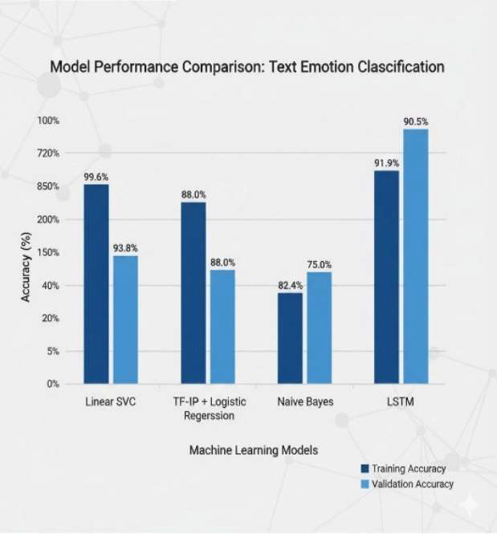
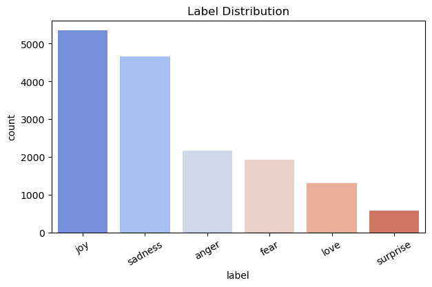
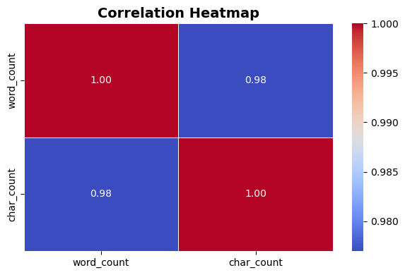

# 🧠 Emotion Detection from Text

A Machine Learning and Natural Language Processing (NLP) project that classifies textual data into six emotions: **anger, fear, joy, love, sadness, and surprise**. This project explores both classical machine learning and deep learning approaches for multi-class emotion classification and compares their performance using standard evaluation metrics.

---

## 📌 Project Overview

The objective of this project is to build an end-to-end emotion detection system capable of identifying emotions expressed in text. The workflow includes data preprocessing, exploratory data analysis, feature engineering, model training, and performance evaluation.

---

## 📌 Project Status

✅ Data Preprocessing Completed

✅ Exploratory Data Analysis Completed

✅ Model Training and Evaluation Completed

✅ Project Report Completed

⏳ Web Application Deployment Planned

### Key Features

* Text preprocessing using NLP techniques
* Exploratory Data Analysis (EDA)
* TF-IDF Vectorization and Word Embeddings
* Comparison of Machine Learning and Deep Learning models
* Multi-class emotion classification

---

## 🧰 Tech Stack

### Languages

* Python

### Libraries

* Pandas
* NumPy
* Scikit-learn
* NLTK
* TensorFlow / Keras
* Matplotlib
* Seaborn

### Tools

* Jupyter Notebook
* Git
* GitHub

---

## 📂 Project Structure

```text
Emotion-detection-from-text-ml
│
├── notebooks
│   ├── EDAFinal.ipynb
│   ├── PreprocessingFinal.ipynb
│   └── ModelTrainingFinal.ipynb
│
├── data
│   ├── trainingpp.csv
│   └── testpp.csv
│
├── images
│   ├── emotion_distribution.png
│   ├── heatmap.png
│   ├── model_comparison.png
│   └── linear_svc_results.png
│
├── report
│   └── Emotion_Detection_Project_Report.pdf
│
├── README.md
├── requirements.txt
└── .gitignore
```
---

## 📊 Dataset

**Dataset Used:** Emotion Dataset by Parul Pandey

** Source: [Emotion Dataset by Parul Pandey](https://www.kaggle.com/datasets/parulpandey/emotion-dataset)
* Total Samples: 15,969
* Emotion Classes:

  * Anger
  * Fear
  * Joy
  * Love
  * Sadness
  * Surprise

---

## 🧹 Data Preprocessing

The following preprocessing techniques were applied:

* Text Cleaning
* Lowercasing
* Tokenization
* Stopword Removal
* TF-IDF Vectorization
* Word Embeddings

---

## 🤖 Models Implemented

1. Naive Bayes
2. Logistic Regression
3. Linear Support Vector Classifier (SVC)
4. Long Short-Term Memory (LSTM)

---

## 📈 Results

| Model               | Test Accuracy |
| ------------------- | ------------- |
| Naive Bayes         | 75.0%         |
| Logistic Regression | 86.5%         |
| Linear SVC          | 89.4%         |
| LSTM                | 90.6%         |

---

## 🏆 Key Findings

* LSTM achieved the highest test accuracy of **90.6%**.
* Linear SVC achieved **89.4%** accuracy and demonstrated strong generalization performance.
* Deep learning models captured contextual information more effectively than traditional machine learning models.
* Proper preprocessing and feature engineering significantly improved classification performance.

---
## 📈 Visualizations

### Model Performance Comparison



Comparison of training and validation accuracy across Naive Bayes, Logistic Regression, Linear SVC, and LSTM models.

### Linear SVC Results


Detailed classification report and performance metrics of the Linear SVC model, which achieved 89.4% test accuracy.

### Emotion Distribution



Distribution of the six emotion classes present in the dataset.

### Correlation Heatmap



Correlation analysis between dataset features used during exploratory data analysis.

---
## 🎯 Applications

* Mental Health Monitoring
* Emotion-Aware Chatbots
* Customer Feedback Analysis
* Social Media Monitoring
* Human–Computer Interaction Systems

---

## 🚀 How to Run

```bash
git clone https://github.com/mehakar09/Emotion-detection-from-text-ml.git

cd Emotion-detection-from-text-ml

pip install -r requirements.txt
```

Open the notebooks in Jupyter Notebook and run them sequentially.

---

## 📄 Project Report

The detailed project report is available in the repository:

- [Project Report](report/Emotion_Detection_From_Text_Report.pdf)
  
---

## 👥 Team

Developed by:

* Mehak Arora
* Nidhi

---

## 📝 License

This project is licensed under the MIT License.
Feel free to use, modify, and distribute it with proper attribution.

     


